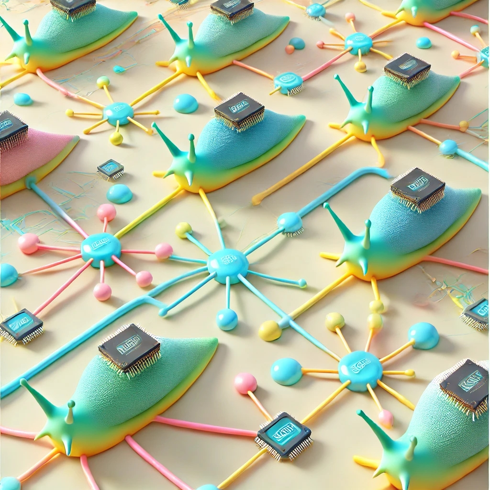

# CSE 232: Distributed Systems
University of California, Santa Cruz,  Spring 2025 \

***********************************************
 |  [Description](#description) | [Teaching Team](#teaching-team) | [Lectures](#lectures) | [Papers](#papers-for-presentation) | [Evaluation](#evaluation) |

<!-- ### | [Announcements](#announcements)   -->
<!-- [Papers for presentation](#papers-for-presentation) | [Sample Questions](#sample-questions) | -->

 

<!-- ---------------------------------------------------------------------- -->
<!-- Markdown notes -->

<!-- 
To see press html, ctrl+alt+o.
-->

<!-- How to write bullet lists --> 
<!--

- item
   - inner item
   - inner item second
- item second

-->

***********************************************
## Links

- Announcements: [Canvas](https://canvas.ucsc.edu/courses/82502/announcements)
- Lecture Recordings: [Yuja](https://media.ucsc.edu/P/VideoManagement/MediaLibrary/MediaChannel/1780888)
- Assignments: 
   - Questions: [Canvas](https://canvas.ucsc.edu/courses/82502/assignments)
   - Submit solutions:  [Gradescope](https://www.gradescope.com/courses/1015997)
- Discussion session: [Zoom](https://ucsc.zoom.us/j/6673631998?pwd=fvbxE7heYPstzHcJbSqlWXaetZLFxb.1)

<!--***********************************************
## Announcements:

We will make announcements in [Canvas](https://canvas.ucsc.edu/courses/82502/announcements).-->

***********************************************
## Description

Distribution is ubiquitous in modern computing systems. For example, today's telephone systems, banking systems, global information systems, and aircraft and nuclear power plant control systems all depend critically on distributed algorithms. Robust distributed algorithms should offer reliability and security despite process failures, network disconnections, or even malicious attacks on processes. This course will introduce fundamental distributed computing problems and provides a collection of applicable algorithms. It also presents formal specification and rigorous reasoning about distributed algorithms. The course follows a modular and layered approach to the implementation of distributed abstractions. It covers reliable broadcast, causal broadcast, total-order broadcast, distributed shared memory, consensus variants including blockchain consensus, atomic commit and terminating reliable broadcast, and replicated systems. The course considers processes that are subject to crashes and also malicious attacks by non-cooperating processes.

In this course, we will have both lectures by the instructor, and presentations by students. The presenter presents a paper or related papers and leads the discussion.

### Textbook:
- Introduction to Reliable and Secure Distributed Programming  
- Christian Cachin, Rachid Guerraoui, Luís Rodrigues  
- Second Edition, Springer, 2011, XIX, 320 pages, ISBN-13: 978-3-642-15259-7  
- DOI: doi:10.1007/978-3-642-15260-3  

***********************************************
## Teaching Team:
- Instructor:
   - [Mohsen Lesani](https://mohsenlesani.github.io/)
   - <<mlesani@ucsc.edu>>
- TA:   
   - Karthik Krishnaraj Bhat 
   - <<kabhat@ucsc.edu>>

### Office hours:
- TA:  
   - 3pm-4pm Wednesdays via Zoom
   - Discussion session: 11am-12pm Fridays via Zoom
   - [Zoom link](https://ucsc.zoom.us/j/6673631998?pwd=fvbxE7heYPstzHcJbSqlWXaetZLFxb.1)

- Instructor:
   - Tue 11-12am
   - Please email me so that I know that you want to come to the office hours.   
   - I am in most days. You can also email me and we can find a time to meet.

***********************************************
## Lectures

<!-- ### Lectures: -->
- Time and place:
   - Tuesday Thursday 01:30-03:05pm
   - Physical Sciences 130

We may have multiple lectures on a topic.
Please read the slides and suggested reading before the lectures.

In order to best observe the animations in the slides, 
view them in the "Single page" view rather than "Continuous scroll" view.

The class is automatically recorded and you can view the recordings in the class channel on [Yuja](https://media.ucsc.edu/P/VideoManagement/MediaLibrary/MediaChannel/1780888).

1. Introduction
   - [[Slides]](1.Slides/introduction.pdf)  
   - Introduction Components, Process Abstraction, Communication Abstraction, Time Abstraction  
   - Reading: Sections 1.4, and Sections 2.2, 2.4, 2.6 of the textbook

1. Reliable Broadcast
   - [[Slides]](1.Slides/reliable-broadcast.pdf)  
   - Reading: Sections 3.2, 3.3, 3.4, 3.9 of the textbook

1. Causal Broadcast
   - [[Slides]](1.Slides/causal-broadcast.pdf)  
   - Reading: Section 3.9 of the textbook

1. Shared Memory, Regular
   - [[Slides]](1.Slides/memory-regular.pdf)  
   - Reading: Sections 4.2 of the textbook

1. Shared Memory, Atomic
   - [[Slides]](1.Slides/memory-atomic.pdf)  
   - Reading: Sections 4.3, 4.4 of the textbook

1. Consensus and Quorums  
   - [[Slides]](1.Slides/consensus.pdf)
   - Reading: Section 2.7, and Section 5.1, 5.2, 5.3 of the textbook

1. Total order Broadcast   
   - [[Slides]](1.Slides/total-order-broadcast.pdf)  
   - Reading: Section 6.1, 6.2 of the textbook

1. Atomic Commit
   - [[Slides]](1.Slides/atomic-commit.pdf)  
   - Reading: Section 6.6 of the textbook

1. Bitcoin
   - [[Slides]](1.Slides/bitcoin.pdf)  
   - Reading: Bitcoin A Peer-to-Peer Electronic Cash System. Nakamoto. White paper. 2008.  

1. Randomized consensus
   - [[Slides]](1.Slides/randomized-consensus.pdf)  
   - Reading: Section 5.5 of the textbook

1. Terminating Reliable Broadcast
   - [[Slides]](1.Slides/terminating-reliable-broadcast.pdf)  
   - Reading: Section 6.3 of the textbook

1. View Synchronous Communication
   - [[Slides]](1.Slides/view-synch-comm.pdf)  
   - Reading: Section 6.8 of the textbook

1. Byzantine Broadcast
   - [[Slides]](1.Slides/byz-reliable-broadcast.pdf)  
   - Reading: Sections 3.10, 3.11, 3.12 of the textbook

1. Byzantine Consensus
   - [[Slides]](1.Slides/byz-consensus.pdf)  
   - Reading: Section 5.6 of the textbook

<!--1. Coordination Synthesis
   - [[Slides]](1.Slides/coordination-synthesis.pdf)   
   - The notion of conflict, and coordination minimization by graph optimization-->

***********************************************
## Papers for presentation

-
   - A comprehensive study of Convergent and Commutative Replicated Data Types.
   - M. Shapiro, N. Preguica, C. Baquero, M. Zawirski.
   - Doctoral dissertation, Inria–Centre Paris-Rocquencourt; INRIA 2011

<!--     -->

-
   - Hamsaz: Replication Coordination Analysis and Synthesis
   - Farzin Houshmand, Mohsen Lesani
   - POPL '19 (ACM SIGPLAN Symposium on Principles of Programming Languages)  

<!--  -->

-
   - Hambazi: Spatial Coordination Synthesis for Augmented Reality
   - Yi-Zhen Tsai, Jiasi Chen, Mohsen Lesani
   - OOPSLA '25 (ACM SIGPLAN conference on Object-oriented Programming, Systems, Languages, and Applications)

<!--  -->

-
   - Hamraz: Resilient Partitioning and Replication
   - Xiao Li, Farzin Houshmand, Mohsen Lesani
   - S&P '22 (IEEE Symposium on Security and Privacy)  

<!--  -->

-
   - Deconstructing Stellar Consensus.
   - A. G. Perez, M. A. Schett
   - OPODIS 2019.  

<!--  -->

-
   - Atomic cross-chain swaps
   - Maurice Herlihy
   - PODC 2018 (ACM symposium on principles of distributed computing. 2018)  

***********************************************
# Evaluation

We post the assignments on
[Canvas](https://canvas.ucsc.edu/courses/82502/assignments)
and you submit your solutions on 
[Gradescope](https://www.gradescope.com/courses/1015997).

- Four Assignments: 10% each
   - Written Assignment 1: Release: April 8, Submission: April 15
   - Written Assignment 2: Release: April 29, Submission: May 6
   - Programming Assignment: Release: May 6, Submission: May 29
   - Written Assignment 3: Release: May 27, Submission: June 3
- Midterm Exam: 30%
   - May 20 in the class
- Presentation and discussion: extra credit
   - Four presentations in the last week, June 3 and 5
- Final Exam: 30%
   - Finals week, June 11, 4-7pm, in the class
   
- We keep track of attendance, and only those that attend regularly will get their grades scaled.  

<!--
CSE 232 Schedule

April
1   1                3
2   8   H1r       10
3   15 H1        17 
4   22              24
5   29  H2r      1
May
6   6   H2 PAr  8
7   13              15
->
8    20 M         22 Solve Midterm, PA discussion
9    27 H3r      29 PA
June
10  3   H3       5   4 Presentations

Final: June 11, 4-7pm
-->

## Academic Integrity

One of the joys of university life is socializing and working with your classmates. We want you to make friends with each other and discuss the material. That said, I expect all assignments (code, write-ups, and tests) to be your own original work. If you work together with a classmate on an assignment, please mention this, e.g. in the comments of your code. If you use a figure you didn’t create in a write-up, then it needs a citation. Please review the [university's policy on plagiarism](https://guides.library.ucsc.edu/citesources/plagiarism). This class has a zero-tolerance policy on cheating. Please don’t do it.

As a final note on cheating: the economic condition facing computer science graduates is volatile in the near future. It is crucial that you benefit from your time at the university, and learn the concepts thoroughly. If you cheat, you will not be able to stand out from others who put in the effort when it comes time to find a job. Cheating will have a devastating impact on your own career opportunities. Just don’t do it.

We are in an exciting time for AI, especially for tools like Github co-pilot and LLMs (e.g., ChatGPT). These tools have incredible potential and they are improving every day. However, the educational community has not had sufficient time to understand their impact on learning objectives. This class has been designed to be taken without the use of AI tools. They are not allowed to be used in the course. If we suspect abuse, then we may implement random audits of assignments, where you will be asked to explain your implementation in detail.
If you are interested in seeing how these tools can help, please feel free to use them after you have submitted a non-AI version of the homework.
  
***********************************************
